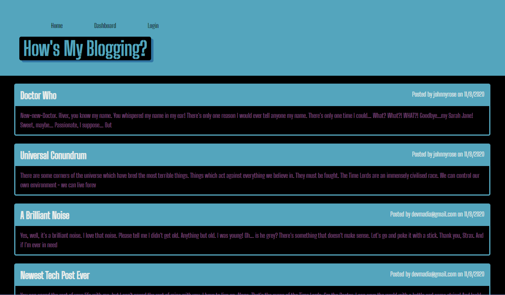
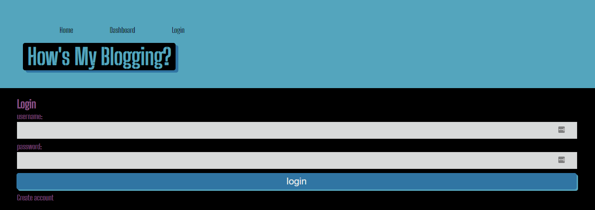
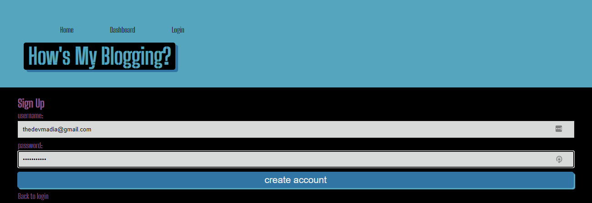
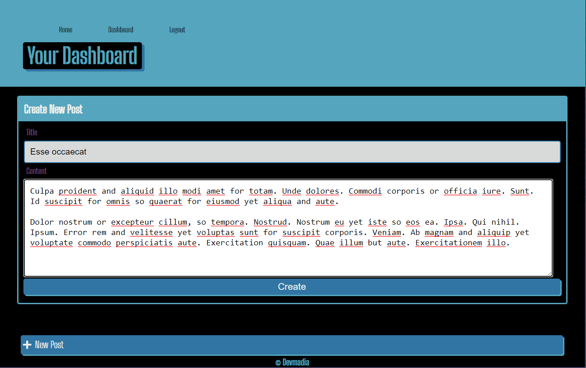
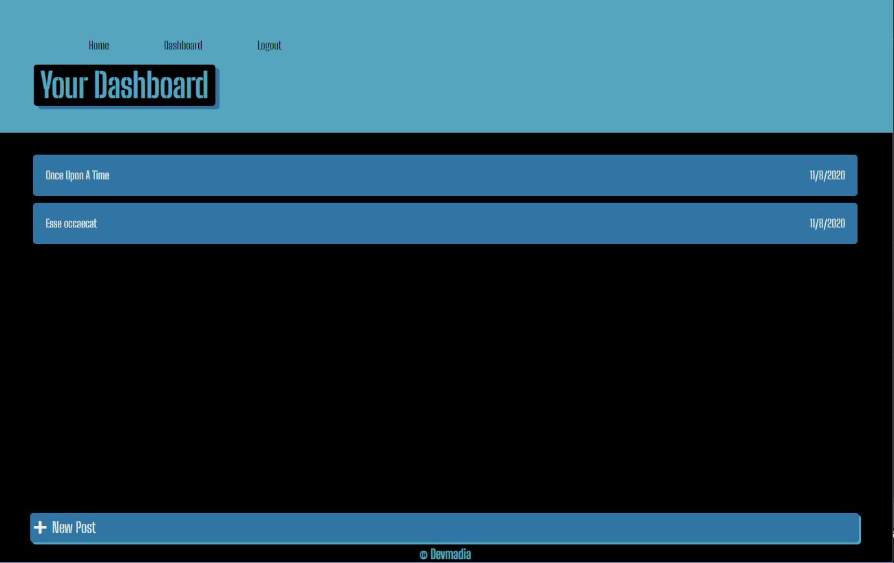
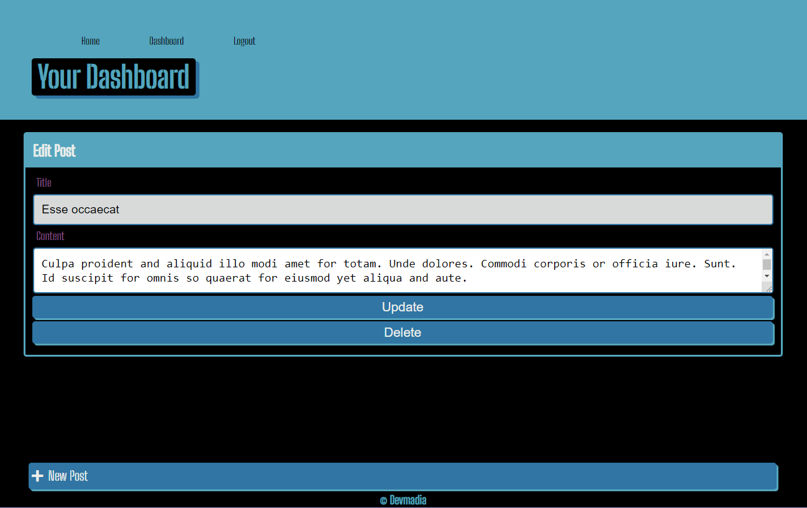

# hows-my-blogging

## Description

A CMS-style blog site for developers to publish their blog posts and comment on other developer's posts.

  ## Table of Contents

  * [Installation](#installation)
  * [Usage](#usage)
  * [License](#license)
  * [Contribution](#contribution)
  * [Questions](#questions) 
  
  ## Installation
  Initiate a clone or pull of a project's repo onto your local machine, then change directory to file location and run installation for dependencies by typing `npm install` in the root directory terminal window.

  ## Usage
  Before anything, run the schema.sql file to get MySQL server to create your database through which accounts, posts, and such information is stored. You will need to know and have MySQL installed for this. Unless you are deploying to a webhost, your application will default to http://localhost:3001 for previewing and demonstration purposes.

   

  When the application is spun up on a server, it will resemble the following. Users will need to click `Login` and go to the bottom of the form to select `Create Account` to use the website. After an account is created, users will be rerouted to their Dashboard.

  

  Once rerouted to their Dashboard, users can select `+ New Post` to create an entry while logged in.

  

  A user will always see their specific posts on the Dashboard.

  

  If at any point a user wishes to `Update` or `Delete` their entries, they simply need only click on a title and select the option they prefer.

  

  Once logged out, users will see all the posts with title and a sniplets.

  ## License
   This project is covered by the MIT license.

  ## Contributing
  At this time, I am not seeking contributors to my portfolio.

  ## Questions
  Please contact Devmadia by clicking below for immediate questions regarding site content:

  

  For other projects by Devmadia [click here](https://github.com/Devmadia)
  